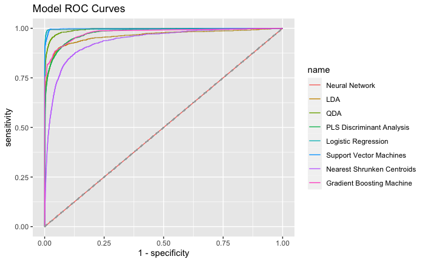

# ADS-503 Applied Predictive Analytics Project
## Financial Datasets For Fraud Detection
Leonard Littleton  
Lina Nguyen  
Emanuel Lucban  

______

## Downloads

**Dataset for the project can be downloaded here**  
Kaggle - [Synthetic Financial Datasets for Fraud Detection](https://www.kaggle.com/ealaxi/paysim1)  

**RDS files for all trained models can be downloaded here**  
*Note: zip file is 30GB*  
[rds_files.zip](https://usd-mads-projects.s3.us-west-1.amazonaws.com/ADS503/Final_Project/rds_files.zip)

______

## Models Tested
* Quadratic Discriminant Analysis
* Support Vector Machines
* Logistic Regression
* Gradient Boosting Machine
* Linear Discriminant Analysis
* Nearest Shrunken Centroids
* Neural Networks
* Partial Least Squares Discriminant Analysis  

______

## Model Performance

**ROC Curves**

**Metrics**  
<table>
 <thead>
  <tr>
   <th style="text-align:left;"> Models </th>
   <th style="text-align:right;"> AUC </th>
   <th style="text-align:right;"> Sensitivity </th>
   <th style="text-align:right;"> Specificity </th>
   <th style="text-align:right;"> Pos.Pred.Value </th>
   <th style="text-align:right;"> Neg.Pred.Value </th>
   <th style="text-align:right;"> Precision </th>
   <th style="text-align:right;"> Recall </th>
   <th style="text-align:right;"> F1 </th>
   <th style="text-align:right;"> Prevalence </th>
   <th style="text-align:right;"> Detection.Rate </th>
   <th style="text-align:right;"> Detection.Prevalence </th>
   <th style="text-align:right;"> Balanced.Accuracy </th>
  </tr>
 </thead>
<tbody>
  <tr>
   <td style="text-align:left;"> Quadratic Discriminant Analysis </td>
   <td style="text-align:right;"> 0.9927164 </td>
   <td style="text-align:right;"> 0.8594569 </td>
   <td style="text-align:right;"> 0.9937371 </td>
   <td style="text-align:right;"> 0.1534927 </td>
   <td style="text-align:right;"> 0.9998132 </td>
   <td style="text-align:right;"> 0.1534927 </td>
   <td style="text-align:right;"> 0.8594569 </td>
   <td style="text-align:right;"> 0.2604678 </td>
   <td style="text-align:right;"> 0.0013196 </td>
   <td style="text-align:right;"> 0.0011341 </td>
   <td style="text-align:right;"> 0.0073888 </td>
   <td style="text-align:right;"> 0.9265970 </td>
  </tr>
  <tr>
   <td style="text-align:left;"> Support Vector Machines </td>
   <td style="text-align:right;"> 0.9978020 </td>
   <td style="text-align:right;"> 0.7617913 </td>
   <td style="text-align:right;"> 0.9999610 </td>
   <td style="text-align:right;"> 0.9626731 </td>
   <td style="text-align:right;"> 0.9996853 </td>
   <td style="text-align:right;"> 0.9626731 </td>
   <td style="text-align:right;"> 0.7617913 </td>
   <td style="text-align:right;"> 0.8505319 </td>
   <td style="text-align:right;"> 0.0013196 </td>
   <td style="text-align:right;"> 0.0010052 </td>
   <td style="text-align:right;"> 0.0010442 </td>
   <td style="text-align:right;"> 0.8808762 </td>
  </tr>
  <tr>
   <td style="text-align:left;"> Logistic Regression </td>
   <td style="text-align:right;"> 0.9964422 </td>
   <td style="text-align:right;"> 0.7308242 </td>
   <td style="text-align:right;"> 0.9999553 </td>
   <td style="text-align:right;"> 0.9557632 </td>
   <td style="text-align:right;"> 0.9996444 </td>
   <td style="text-align:right;"> 0.9557632 </td>
   <td style="text-align:right;"> 0.7308242 </td>
   <td style="text-align:right;"> 0.8282937 </td>
   <td style="text-align:right;"> 0.0013196 </td>
   <td style="text-align:right;"> 0.0009644 </td>
   <td style="text-align:right;"> 0.0010090 </td>
   <td style="text-align:right;"> 0.8653898 </td>
  </tr>
  <tr>
   <td style="text-align:left;"> Gradient Boosting Machine </td>
   <td style="text-align:right;"> 0.9777450 </td>
   <td style="text-align:right;"> 0.6279181 </td>
   <td style="text-align:right;"> 0.9999465 </td>
   <td style="text-align:right;"> 0.9394155 </td>
   <td style="text-align:right;"> 0.9995086 </td>
   <td style="text-align:right;"> 0.9394155 </td>
   <td style="text-align:right;"> 0.6279181 </td>
   <td style="text-align:right;"> 0.7527127 </td>
   <td style="text-align:right;"> 0.0013196 </td>
   <td style="text-align:right;"> 0.0008286 </td>
   <td style="text-align:right;"> 0.0008820 </td>
   <td style="text-align:right;"> 0.8139323 </td>
  </tr>
  <tr>
   <td style="text-align:left;"> Linear Discriminant Analysis </td>
   <td style="text-align:right;"> 0.9621525 </td>
   <td style="text-align:right;"> 0.4030491 </td>
   <td style="text-align:right;"> 0.9999037 </td>
   <td style="text-align:right;"> 0.8468468 </td>
   <td style="text-align:right;"> 0.9992118 </td>
   <td style="text-align:right;"> 0.8468468 </td>
   <td style="text-align:right;"> 0.4030491 </td>
   <td style="text-align:right;"> 0.5461588 </td>
   <td style="text-align:right;"> 0.0013196 </td>
   <td style="text-align:right;"> 0.0005319 </td>
   <td style="text-align:right;"> 0.0006280 </td>
   <td style="text-align:right;"> 0.7014764 </td>
  </tr>
  <tr>
   <td style="text-align:left;"> Nearest Shrunken Centroids </td>
   <td style="text-align:right;"> 0.9362662 </td>
   <td style="text-align:right;"> 0.0724154 </td>
   <td style="text-align:right;"> 0.9987977 </td>
   <td style="text-align:right;"> 0.0737148 </td>
   <td style="text-align:right;"> 0.9987744 </td>
   <td style="text-align:right;"> 0.0737148 </td>
   <td style="text-align:right;"> 0.0724154 </td>
   <td style="text-align:right;"> 0.0730594 </td>
   <td style="text-align:right;"> 0.0013196 </td>
   <td style="text-align:right;"> 0.0000956 </td>
   <td style="text-align:right;"> 0.0012963 </td>
   <td style="text-align:right;"> 0.5356065 </td>
  </tr>
  <tr>
   <td style="text-align:left;"> Neural Network </td>
   <td style="text-align:right;"> 0.5000000 </td>
   <td style="text-align:right;"> 0.0000000 </td>
   <td style="text-align:right;"> 1.0000000 </td>
   <td style="text-align:right;"> NaN </td>
   <td style="text-align:right;"> 0.9986804 </td>
   <td style="text-align:right;"> NA </td>
   <td style="text-align:right;"> 0.0000000 </td>
   <td style="text-align:right;"> NA </td>
   <td style="text-align:right;"> 0.0013196 </td>
   <td style="text-align:right;"> 0.0000000 </td>
   <td style="text-align:right;"> 0.0000000 </td>
   <td style="text-align:right;"> 0.5000000 </td>
  </tr>
  <tr>
   <td style="text-align:left;"> PLS Discriminant Analysis </td>
   <td style="text-align:right;"> 0.9771492 </td>
   <td style="text-align:right;"> 0.0000000 </td>
   <td style="text-align:right;"> 1.0000000 </td>
   <td style="text-align:right;"> NaN </td>
   <td style="text-align:right;"> 0.9986804 </td>
   <td style="text-align:right;"> NA </td>
   <td style="text-align:right;"> 0.0000000 </td>
   <td style="text-align:right;"> NA </td>
   <td style="text-align:right;"> 0.0013196 </td>
   <td style="text-align:right;"> 0.0000000 </td>
   <td style="text-align:right;"> 0.0000000 </td>
   <td style="text-align:right;"> 0.5000000 </td>
  </tr>
</tbody>
</table>

______
## References  

Lopez-Rojas, Edgar. (2017). Synthetic Financial Datasets For Fraud Detection. Kaggle.
https://www.kaggle.com/ealaxi/paysim1.

